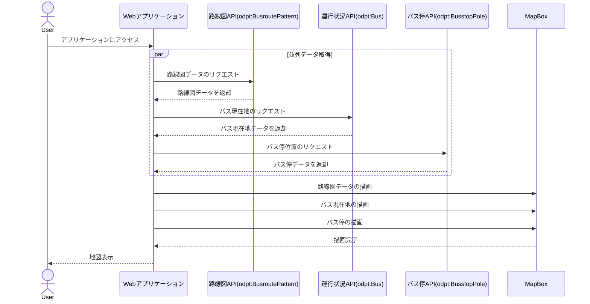

```mermaid
sequenceDiagram
    actor User
    participant WebApp as Webアプリケーション
    participant RouteAPI as 路線図API(odpt:BusroutePattern)
    participant BusAPI as 運行状況API(odpt:Bus)
    participant StopAPI as バス停API(odpt:BusstopPole)
    participant Map as MapBox

    User->>WebApp: アプリケーションにアクセス
    
    par 並列データ取得
        WebApp->>RouteAPI: 路線図データのリクエスト
        RouteAPI-->>WebApp: 路線図データを返却
        
        WebApp->>BusAPI: バス現在地のリクエスト
        BusAPI-->>WebApp: バス現在地データを返却
        
        WebApp->>StopAPI: バス停位置のリクエスト
        StopAPI-->>WebApp: バス停データを返却
    end
    
    WebApp->>Map: 路線図データの描画
    WebApp->>Map: バス現在地の描画
    WebApp->>Map: バス停の描画
    
    Map-->>WebApp: 描画完了
    WebApp-->>User: 地図表示
```